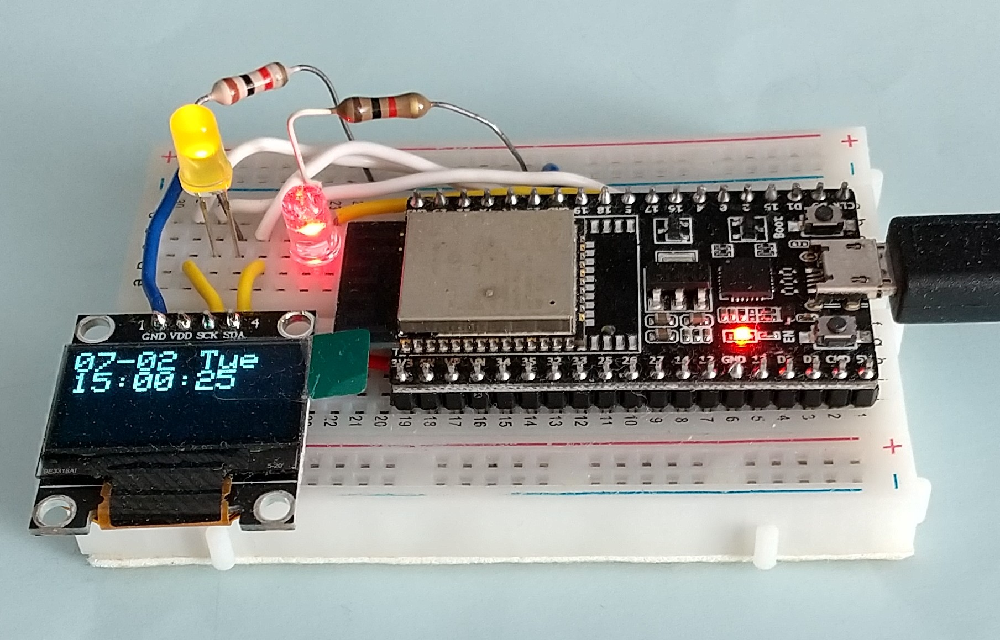
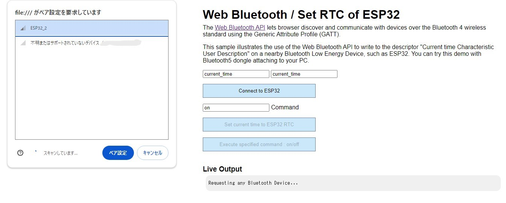

<H3>Bluetoothを使ってESP32のRTCを設定する</H3>

ESP32のBluetooth機能を使用して、RTCに時刻を設定する方法を紹介する。Bluetooth（BLE）にはGATT（Generic Attribute Profile）という規格があり 
周囲のデバイスが提供するサービスを認知することができる。その中に"current time"というサービスがあり、このサービスでは、デバイスの時刻が参照できるようになっている。 
ここでは、そのサービスをESP32側に実装し、<a href="https://developer.chrome.com/docs/capabilities/bluetooth?hl=ja">Web Bluetooth</a>の機能を利用して、
外部のブラウザから、現在時刻をESP32のRTC（クロック）に設定する方法について説明する。

<strong>"current time"サービスの実装</strong> 
ESP32にService"current time"、Characteristicとして"current time"を設定したBLEサーバーを定義する。現在時刻の設定先としてDescriptorを追加しておく。 
BLEサーバーのアドバタイズをスタートさせると、ESP32の"current time"サービスが外部から認知できるようになる。 
外部から、現在時刻がDescriptorに書き込まれると、Descriptorのコールバックの onWrite()関数に通知される。 

<strong>H/W構成</strong> 
 ・ESP32 DevkitC 
 ・SD1306 128x64 OLED表示装置 
 ・LED 
  <ul>
   <li>BuitIn LED：5(1kΩ程度の抵抗を経由して接続)&nbsp;&nbsp;使用したESP32にはBuitIn LEDが無いので外付けした</li>
   <li>Control用LED：17(1kΩ程度の抵抗を経由して接続)</li>
  </ul>

<strong>ブラウザの操作</strong> 
  <ol>
   <li>Chromeを開いて"Web_Bluetooth_Set_RTC.html"をドラッグ＆ドロップする。</li>
   <li>"Connect to ESP32"ボタンを押す。Bluetoothデバイスのスキャン画面が表示される。</li>
   <li>スキャン画面に"ESP32_2"が表示されるので選択して"ペア設定"ボタンを押す。</li>
   <li>接続状態（約30秒間。BuitIn LEDが点滅）になるので"Set current time to ESP32 RTC"ボタンを押す。</li>
   <li>現在の時刻が表示される。</li>
  </ol>
  なお、Control用LEDを配線した場合は,接続状態にして"Execute specified command : on/off"ボタンを押すとControl用LEDが点灯する。 
  Commandに"off"と入力して"Execute specified command : on/off"ボタンを押すとControl用LEDが消灯する。 
  このCommand実行機能は、拡張して他の制御機能にも利用できる。

<strong>接続</strong> 
OLED表示装置の接続は以下の通り。 

<table> 
<tr>
<td>I2C&nbsp;</td><td>ESP32</td>
</tr>
<tr>
<td>SCK</td><td>21</td>
<tr>
<tr>
<td>SDA</td><td>22</td>
<tr>
</table>

<strong>インストール</strong> 
<ol>
<li>コードを、ZIP形式でダウンロード</li>
<li>ArduinoIDEにおいて、ライブラリマネージャから以下を検索してインストールする</li>
 <ul>
  <li>Adafruit_BusIO</li>
  <li>Adafruit_GFX</li>
  <li>Adafruit_SSD1306</li>
 </ul>
<li>ArduinoIDEからESP32_WebBLE_clock_set_master.inoを開く</li>
<li>「検証・コンパイル」に成功したら、一旦、「名前を付けて保存」を行う</li>
</ol>

<strong>若干の解説</strong> 
・PCにはBluetooth機能かBluetooth(5.0以降)のUSBドングルが必要である。 
・ブラウザはChromeだけでなく、Edgeでも動作した。スマートフォンのChromeでも動作する。 
・ここで使用した"Web_Bluetooth_Set_RTC.html"は冒頭のWeb Bluetoothサイトのサンプルを改造したものである。 

<strong>注意事項</strong> 
・利用の際は、自己責任でお楽しみください。 

